<div align="center">

# ✨ Personal Portfolio Website

### A modern and elegant single-page portfolio built with React

**Showcasing skills • experience • services • projects • achievements**

<br>


</div>

---

## 📌 About The Project

This is a **personal portfolio website** created to present professional information, experience, services, projects, client feedback, awards and contact details in a clean and attractive layout.

The website is built using reusable React components, Bootstrap for the layout and custom CSS for the overall visual design.

---

## 👀 Preview

### 🎥 Website Video

The complete website walkthrough video is available on Google Drive.

> 🔗 **Video:** https://drive.google.com/file/d/1Uun_Xd0mp82RjYpteADZoBGqhr_YDGBl/view?ts=6a96d3c3

Once the Drive link is added, visitors can open the video and watch the complete website walkthrough.

---
## 📸 Website Components

### 🧭 Header

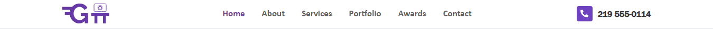

### 🏠 Home

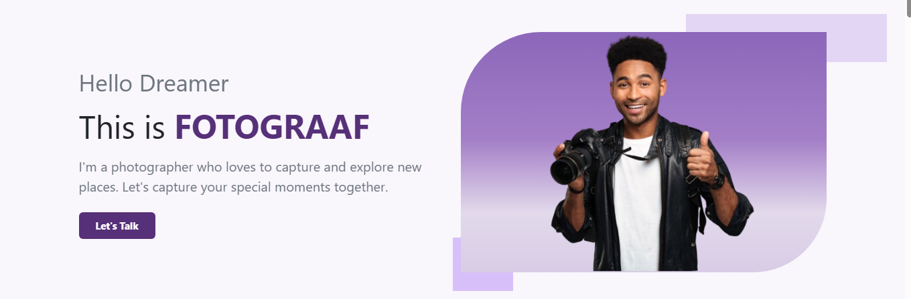

### 👤 About

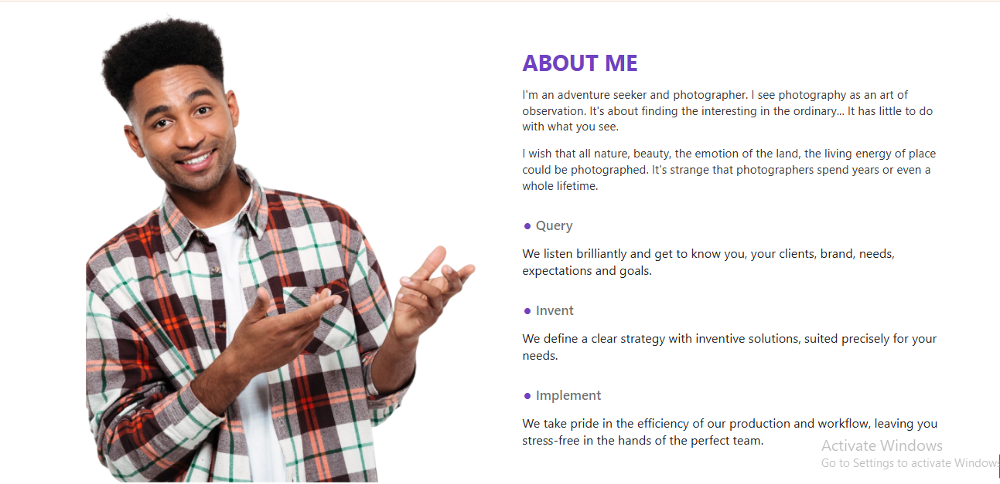

### 📖 Biography

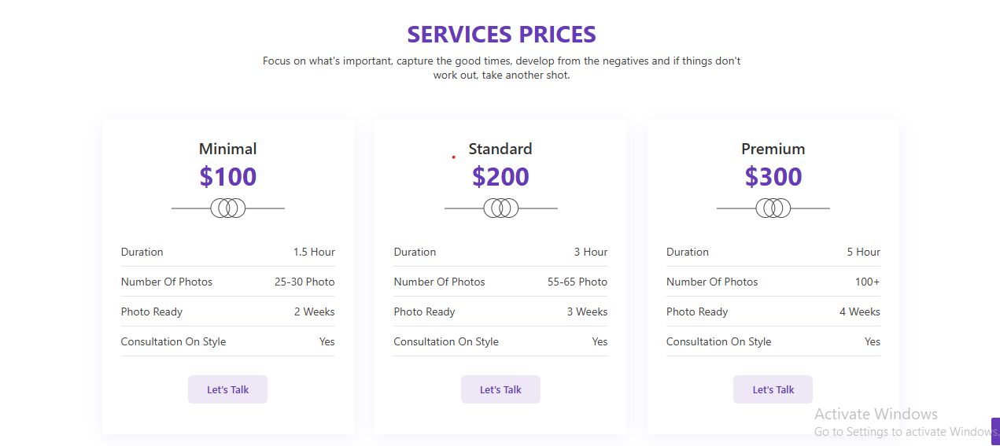

### 💼 Experience

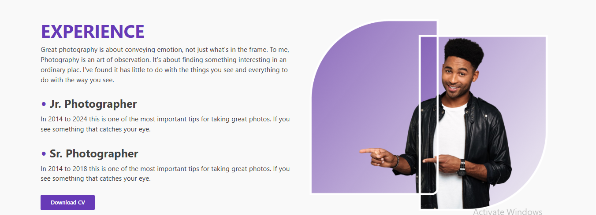

### 🛠️ Services

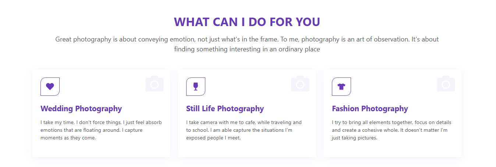

### 🎨 Portfolio

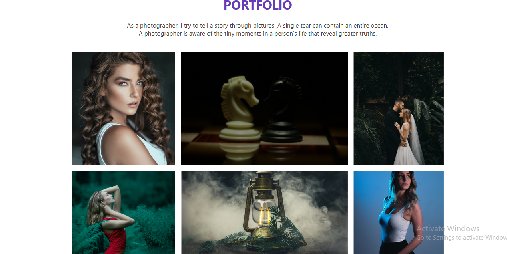

### 💬 Client Feedback

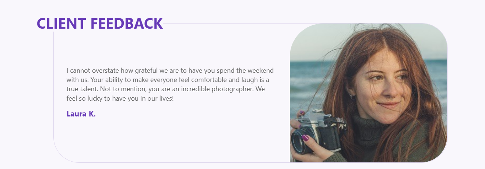

### 🏆 Awards

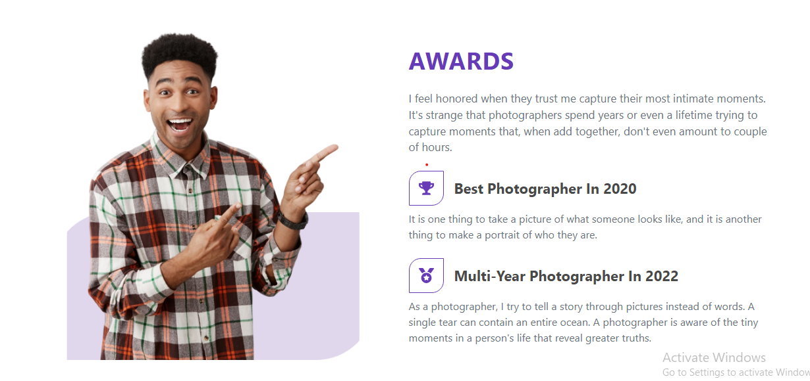

### 📩 Contact

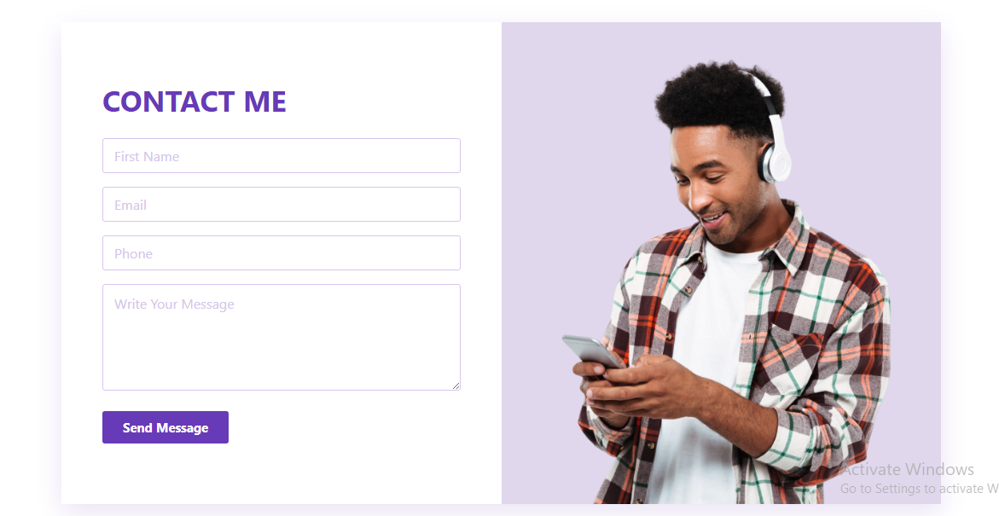

### 🔗 Footer

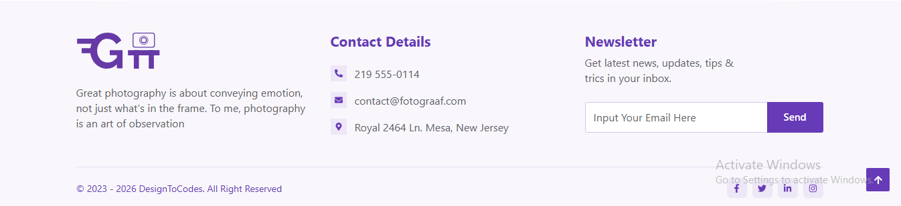
---
## 🌟 Highlights

| ✨ | Feature |
|---|---|
| ⚛️ | Component-based React structure |
| 🎨 | Bootstrap + custom CSS |
| 🧩 | Reusable website sections |
| 🖼️ | Organized image assets |
| 💫 | Custom hover effects |
| 🔗 | Section-based navigation |
| 🎥 | Complete website video walkthrough |
| 📸 | Component-wise screenshots |

---

## 🛠️ Technologies Used

- **React.js**
- **Bootstrap**
- **CSS3**
- **React Icons**
- **JavaScript**
- **HTML5 / JSX**

---

## 📂 Project Structure

```text
portfolio/
│
├── public/
│
├── src/
│   │
│   ├── assets/
│   │   ├── about-person.png
│   │   ├── awards-bg.png
│   │   ├── awards-person.png
│   │   ├── client1.jpg
│   │   ├── client2.jpg
│   │   ├── contact-person.png
│   │   ├── divider.png
│   │   ├── experience.png
│   │   ├── image1.png
│   │   ├── portfolio1.png
│   │   ├── portfolio2.png
│   │   ├── portfolio3.png
│   │   ├── portfolio4.png
│   │   ├── portfolio5.png
│   │   ├── portfolio6.png
│   │   │
│   │   ├── header-screenshot.png
│   │   ├── home-screenshot.png
│   │   ├── about-screenshot.png
│   │   ├── biography-screenshot.png
│   │   ├── experience-screenshot.png
│   │   ├── services-screenshot.png
│   │   ├── portfolio-screenshot.png
│   │   ├── client-feedback-screenshot.png
│   │   ├── awards-screenshot.png
│   │   ├── contact-screenshot.png
│   │   ├── footer-screenshot.png
│   │   │
│   │   └── vite.svg
│   │
│   ├── components/
│   │   ├── Header.jsx
│   │   ├── Home.jsx
│   │   ├── About.jsx
│   │   ├── Biography.jsx
│   │   ├── Experience.jsx
│   │   ├── Services.jsx
│   │   ├── Portfolio.jsx
│   │   ├── ClientFeedback.jsx
│   │   ├── Awards.jsx
│   │   ├── Contact.jsx
│   │   └── Footer.jsx
│   │
│   ├── App.jsx
│   ├── App.css
│   ├── index.css
│   └── main.jsx
│
├── package.json
├── package-lock.json
├── .gitignore
└── README.md
```

> 💡 **Note:** All website images and screenshots are stored directly inside `src/assets/`. There are no separate folders inside `assets/`. All major website styling is maintained in `App.css`.

---

## 🧩 Website Components

### 🧭 Header
Contains the website logo, navigation menu and main call-to-action.

### 🏠 Home
Introduces the portfolio with the main heading, description and hero content.

### 👤 About
Presents personal and professional information along with the supporting visual.

### 📖 Biography
Provides a deeper look into the background and journey.

### 💼 Experience
Showcases professional experience and career journey.

### 🛠️ Services
Displays the services offered through service cards, icons and hover interactions.

### 🎨 Portfolio
Showcases selected projects with images, titles and project information.

### 💬 Client Feedback
Displays client reviews and feedback.

### 🏆 Awards
Highlights awards, achievements and recognitions.

### 📩 Contact
Provides contact information and the contact form.

### 🔗 Footer
Contains additional navigation, links and footer information.

---

## 🔄 Website Workflow

The complete website follows this flow:

```text
                    ┌─────────────┐
                    │   HEADER    │
                    └──────┬──────┘
                           ↓
                    ┌─────────────┐
                    │ HOME / HERO │
                    └──────┬──────┘
                           ↓
                    ┌─────────────┐
                    │    ABOUT    │
                    └──────┬──────┘
                           ↓
                    ┌─────────────┐
                    │  BIOGRAPHY  │
                    └──────┬──────┘
                           ↓
                    ┌─────────────┐
                    │ EXPERIENCE  │
                    └──────┬──────┘
                           ↓
                    ┌─────────────┐
                    │  SERVICES   │
                    └──────┬──────┘
                           ↓
                    ┌─────────────┐
                    │  PORTFOLIO  │
                    └──────┬──────┘
                           ↓
                    ┌─────────────┐
                    │  FEEDBACK   │
                    └──────┬──────┘
                           ↓
                    ┌─────────────┐
                    │   AWARDS    │
                    └──────┬──────┘
                           ↓
                    ┌─────────────┐
                    │   CONTACT   │
                    └──────┬──────┘
                           ↓
                    ┌─────────────┐
                    │   FOOTER    │
                    └─────────────┘
```

---

## ⚛️ React Workflow

```text
main.jsx
    │
    ↓
 App.jsx
    │
    ├── Header
    ├── Home
    ├── About
    ├── Biography
    ├── Experience
    ├── Services
    ├── Portfolio
    ├── ClientFeedback
    ├── Awards
    ├── Contact
    └── Footer
```

`main.jsx` starts the React application, while `App.jsx` brings all portfolio components together.

---

## 🎨 Styling Workflow

The project keeps the styling centralized in `App.css`.

### Bootstrap

Used for:

- Containers
- Rows and columns
- Layout
- Spacing
- Flex utilities
- Buttons
- Alignment

### App.css

Used for:

- Typography
- Colors
- Sections
- Cards
- Images
- Borders
- Hover effects
- Transitions
- Custom design elements

---

## 🖼️ Assets

All images and screenshots are placed directly inside:

```text
src/assets/
```

The folder contains the website's visual assets as well as screenshots used in this README.

---

## 🧭 Navigation Flow

The header navigation connects users to the different sections:

```text
Home → About → Biography → Experience
                 ↓
Services → Portfolio → Client Feedback
                 ↓
Awards → Contact → Footer
```

Each navigation item points to its corresponding section using HTML section IDs.

---

## 🚀 Getting Started

### 1. Install dependencies

```bash
npm install
```

### 2. Start the development server

```bash
npm run dev
```

### 3. Open the local URL

The terminal will show the URL where the project is running.

---

## 📦 Production Build

Create the production build:

```bash
npm run build
```

Preview the production build:

```bash
npm run preview
```

---

## 🎯 Project Goal

The main goal of this portfolio is to communicate:

```text
Who I Am
   ↓
My Background
   ↓
My Experience
   ↓
What I Offer
   ↓
My Work
   ↓
My Achievements
   ↓
Client Feedback
   ↓
Get In Touch
```

The project keeps every major section separate through React components while keeping the overall styling centralized in `App.css`.

---

## ⭐ Project Highlights

- ⚛️ Component-based React structure
- 🎨 Bootstrap layout
- 🖌️ Centralized CSS styling
- 🧩 React Icons
- 🖼️ Organized assets
- ✨ Custom hover effects
- 📸 Component screenshots
- 🎥 Website walkthrough video
- 📁 Clean project structure
- 🔗 Section-based navigation

---

<div align="center">

## 💜 Built With React

**React.js • Bootstrap • CSS3 • React Icons**

<br>

### ✨ Designed to showcase creativity, skills and work.

</div>
